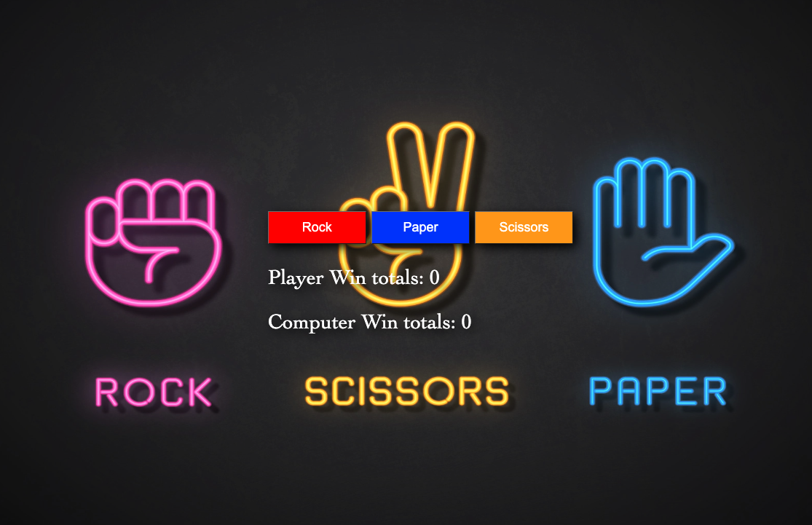

<h1 align="center">Rock Paper Scissors</h1>

   A Project from <a href="https://www.theodinproject.com/" target="_blank">The Odin Project</a>.

  <h3>
    <a href="https://{your-demo-link.your-domain">
      Demo
    </a>
     | 
    <a href="https://github.com/GloBoiVic/rock-paper-scissors">
      Github Repo
    </a>
     | 
    <a href="https://www.theodinproject.com/lessons/foundations-revisiting-rock-paper-scissors">
      Project Description
    </a>
  </h3>

## Table of Contents

- [General Info](#general-information)
- [Technologies Used](#technologies-used)
- [Features](#features)
- [Screenshots](#screenshots)
- [Room for Improvement](#room-for-improvement)
- [Contact](#contact)

## General Information

This is my first real project in JavaScript. The Odin Project Foundation has been a grind to get through as an aspiring self-taught programmer. I have been on my Coding Journey since Oct 2021 and I have learned so much and excited to continue learning more!

This project was particularly challenging because of all the working components: creating the html and manipulating them with JavaScript. I know this was only a taste of the power that is JavaScript

I learned how to write custom functions and how to call those functions when I needed them. Not only learning how to manipulate html elements, I also learned how to inject css into JavaScript. Pretty cool stuff!

Areas needed

## Technologies Used

- Html
- CSS
- JavaScript

## Features

The game is against the computer and both players have to score 5 points to win the game. Computer choice is randomized and an Event Listener is added to the buttons for the User choice.

## Screenshots

## Room for Improvement

Currently, the background interferes with the text of the game. I still need to find a good background or rework the css. I also want to add some kind of interactivity with the game. Like some effect when you click Rock, Paper, or Scissors. I also want to make each button a representation of the actual item.

To do:

- Research a new background for Rock Paper Scissors Game
- Add interactive features

## Contact

- GitHub [@GloBoiVic](https://github.com/vicdatrader) - please reach out to me! I want to connect with other coders!
